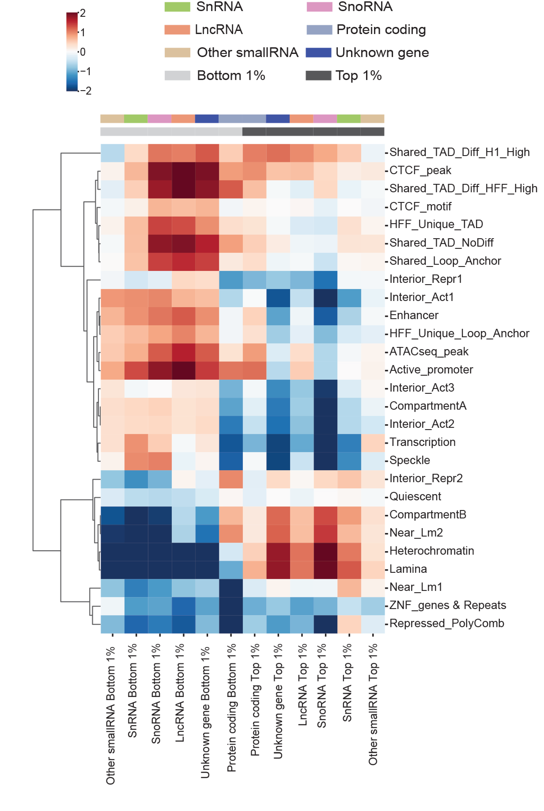

# Exploring the Roles of RNAs in Chromatin Architecture Using Deep Learning
We investigate the roles of chromatin-associated RNAs (caRNAs) on genome folding in HFFc6 cells by bioinformatics analyses and proposing a deep learning framework that leverages both genome sequences and genome-wide RNA-DNA interactions. 

## Roadmap
- [Source code](/Code) Custom code for data exploration, contribution score computation and downstream analyses.
- [Figures](/Code/CaRNAs_in_Chromatin_Architecture_Figures.ipynb) Jupyter notebook for generating the figures.
- [Data](/Data) Some of the processed data for generating the figures. More data could be found at: https://dio.org/10.5281/zenodo.10015010.
- The deep learning framework is built on Akita and the modified code is available upon request.

## Contact
If you have any questions, please feel free to contact shuzhen.kuang@gladstone.ucsf.edu.

